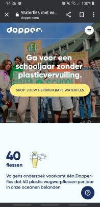
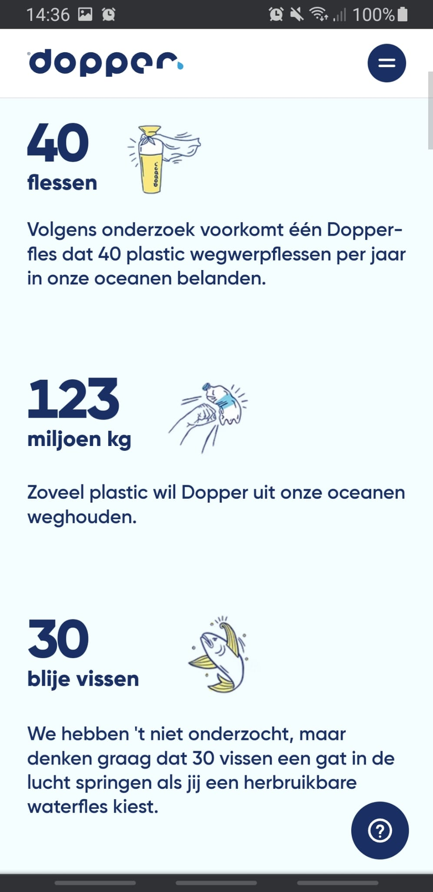

# Procesverslag
Markdown is een simpele manier om HTML te schrijven.  
Markdown cheat cheet: [Hulp bij het schrijven van Markdown](https://github.com/adam-p/markdown-here/wiki/Markdown-Cheatsheet).

Nb. De standaardstructuur en de spartaanse opmaak van de README.md zijn helemaal prima. Het gaat om de inhoud van je procesverslag. Besteedt de tijd voor pracht en praal aan je website.

Nb. Door *open* toe te voegen aan een *details* element kun je deze standaard open zetten. Fijn om dat steeds voor de relevante stuk(ken) te doen.

## Jij

  
Ik ben Bente, woon in Amsterdam en ben 22 jaar oud. Ik hou van muziek luisteren, longboarden en vrienden zien.
  Het eerste jaar CMD vond ik erg leuk, met name de vormgevingsvakken. Internetstandaarden vond ik leuk, CSS/HTML ging mij redelijk goed af. Het vak inleiding programmeren vond ik uitdagend, maar leuk. Uitdagend omdat ik het nog lastig vind overzicht te creëeren in mijn code, maar wel leuk als het uiteindelijk lukte om het gewenste resultaat te krijgen. 

  ### Auteur:
 Bente van der Zeijden

  #### Je startniveau:
  Rood

  #### Je focus:
  Surface Plane
 

## Je website

  
Ik ga de website van Dopper namaken. Dopper is een Nederlands bedrijf dat het gebruik van plastic wegwerpflesjes tegengaat door plastic hervulbare waterflessen te verkopen.

  ### Je opdracht:
  https://dopper.com/nl
  
  #### Screenshot(s) van de eerste pagina (small screen): 
  Landing page (mobile)
  
  
  
  
  

  Landing page (laptop)
  
  
  
  
  

  #### Screenshot(s) van de tweede pagina (small screen):
    Shop page (mobile)
  
  
  
  Shop page (laptop)
  
  
  
  Footer
  
  
  
  
 

## Toegankelijkheidstest 1/2 (week 1)

  
uitwerken na test in 1e werkgroep

In de les heb ik de toegankelijkheid van de Dopper site getest d.m.v. mij in te leven in verschillende beperkingen.
  ### Bevindingen
  Lijst met je bevindingen die in de test naar voren kwamen:

  #### Screenreader
  Hier korte omschrijving (met indien nodig afbeeldingen)
 Het was een vrij frustrerende ervaring om de screenreader te gebruiken. Een robotstem bleef maar alle inhoud op het scherm voorlezen, zonder dat ik er controle over had. Bij de Dopper site viel mij het volgende op:
 - Je moest eerst door alle navigatie tabben, voordat je bij de inhoud van de pagina terecht kwam. Er waren geen shortcut links, waardoor het lang duurde om de eerste pagina te lezen.
 - Tijdens het voorlezen van het submenu, hoorde ik alleen maar "koplink, koplink, koplink". De titel van de link werd niet genoemd.
 - Sommige tekst wordt dubbel voorgelezen. 
 - Hij leest de html voor afbeeldingen voor ipv. een alternatieve tekst

  Hier een omschrijving van hoe het opgelost kan worden (met indien nodig afbeeldingen)
- shortcut links toevoegen ("ga door naar inhoud")
- kopjes goed coderen, altijd een duidelijke titel

  #### Muis en Toetsenbord 
  Hier korte omschrijving (met indien nodig afbeeldingen)
  Ik heb geprobeerd door de site te navigeren zonder mijn muis te gebruiken. 
  - Erdoorheen tabben duurde lang; geen shortcuts, eerst door alle navigatielinks heen
  - Niet duidelijk aangegeven welk element je op gefocust bent
  - Wanneer je door het menu navigeert, blijft het submenu onzichtbaar

  Hier een omschrijving van hoe het opgelost kan worden (met indien nodig afbeeldingen)
- shortcut link
- duidelijke focus states
- submenu in beeld brengen met focus ipv alleen hover

  #### Motoriek (shocks, elastiekjes)
  Hier korte omschrijving (met indien nodig afbeeldingen)
  Ik had een shockapparaatje op mijn onderarm geplakt waardoor mijn arm ongecontroleerde bewegingen maakte.
  - moeilijk om te typen
  - moeilijk op de gewenste knop te drukken
  

  Hier een omschrijving van hoe het opgelost kan worden (met indien nodig afbeeldingen)
- knoppen groter, groter klikbaar veld
- content ietsje dichterbij elkaar zodat je niet ver met je muis hoeft te reizen
- makkelijker maken voor 1 hand bediening

  #### Visueel (brillen, contrast, kleurenblind, dark/light). 
  Hier korte omschrijving (met indien nodig afbeeldingen)
  Ik heb een bril opgedaan waardoor mijn zichtveld beperkt was tot slechts een klein gaatje (peripheral field loss).
  - kan mijn eigen cursor niet meer zien
  - tekst lezen is moeilijk, smalle stukken tekst is wat beter te doen
  
Vervolgens heb ik een bril opgedaan met vlekken in mijn zichtveld (diabetis) 
- kleine letters moeilijk te lezen
- kleurcontrast vermindert. Witte tekst op lichtblauwe vlakken moeilijk te lezen.
  Hier een omschrijving van hoe het opgelost kan worden (met indien nodig afbeeldingen)
- kleurcontrast omhoog
- groot lettertype

## Breakdownschets (week 1)

  
uitwerken na afloop 2e werkgroep

  ### de hele pagina: 
  

  ### dynamisch deel (bijv menu): 
  

  ### wellicht nog een dynamisch deel (bijv filter): 
  

## Voortgang 1 (week 2)

  
Week 1 en 2 gingen goed. De eerste pagina (van de mobiele verise) is bijna af. 

  ### Stand van zaken
  Het stylen van de elementen met CSS ging vrij goed. Het positioneren vond ik wel wat lastiger, ik neig vaak margins 
  te gebruiken terwijl er betere oplossingen zijn.
  
  Daarnaast vond ik het af en toe lastig de juiste semantiek van de HTML te gebruiken. Inmiddels weet ik nu wel het verschil
  tussen sections en articles. Ook realiseer ik nu beter dat het van belang is om je HTML eerst goed op orde te hebben voordat
  je aan de CSS styling begint, scheelt heel wat tijd..
  
  Ook heb ik geprobeerd mijn HTML toegankelijk te maken voor screen-readers. Dit gaf wel een uitdaging: ik wilde een hele article
  klikbaar maken, zonder dat de screen-reader de hele <a> inhoud voor zou lezen. Inmiddels weet ik dat ik daar ::before en position absolute voor kan gebruiken.

  
  
  ### Agenda voor meeting
  samen met je groepje opstellen

  | student 1      | student 2          | student 3    | student 4        |
  | ---            | ---                | ---          | ---              |
  | dit bespreken  | en dit             | en ik dit    | en dan ik dat    |
  | en dat ook nog | dit als er tijd is | nog een punt | dit wil ik zeker |
  | ...            | ...                | ...          | ...              |

  ### Verslag van meeting
  hier na afloop snel de uitkomsten van de meeting vastleggen

  - geen <.hr> gebruiken waar het niet hoort
  - ::before en position absolute gebruiken voor klikbaar veld 
  - <a> in <h3> ipv. andersom, want <a> is inline
  - section heeft altijd een kopje

## Voortgang 2 (week 3)

  
In week 2 heb ik mij vooral bezig gehouden met het responsive maken van mijn website. Voor klein schermformaat heb ik een hamburgermenu toegvoegd en verder heb ik gewerkt met grid om elementen in de secties goed te positioneren. Dit weekend wil ik meer animaties aan mijn website toevoegen.

  ### Stand van zaken
  Mijn CSS bestaat nu uit vrij veel regels. Ik vond het daardoor wel lastig het overzicht te bewaren. Vandaag ging bijv. mijn site "stuk", doordat ik iets op de verkeerde plek had gezet, maar niet meer wist waar. Inmiddels heb ik het opgelost. Ik ben nu bezig mijn CSS overzichtelijker te maken door o.a. comments toe te voegen.

  ### Agenda voor meeting
  samen met je groepje opstellen

  | student 1      | student 2          | student 3    | student 4        |
  | ---            | ---                | ---          | ---              |
  | dit bespreken  | en dit             | en ik dit    | en dan ik dat    |
  | en dat ook nog | dit als er tijd is | nog een punt | dit wil ik zeker |
  | ...            | ...                | ...          | ...              |

  ### Verslag van meeting
  hier na afloop snel de uitkomsten van de meeting vastleggen

  - CSS overzichtelijker maken door o.a. comments toe te voegen
  - Bij het responsive maken goed letten op alle breakpoints

## Toegankelijkheidstest 2/2 (week 4)

  
uitwerken na test in 8e werkgroep

  ### Bevindingen
  Lijst met je bevindingen die in de test naar voren kwamen (geef ook aan wat er verbeterd is):

  #### Screenreader
  Bij de Dopper site viel mij het volgende op:
 - Je moest eerst door alle navigatie tabben, voordat je bij de inhoud van de pagina terecht kwam. Er waren geen shortcut links, waardoor het lang duurde om de eerste pagina te lezen.
 - Tijdens het voorlezen van het submenu, hoorde ik alleen maar "koplink, koplink, koplink". De titel van de link werd niet genoemd.
 - Sommige tekst wordt dubbel voorgelezen. 
 - Hij leest de html voor afbeeldingen voor ipv. een alternatieve tekst
  
  In mijn site heb ik het volgende verbeterd:
  - Ik heb gezorgd dat alle headings en linkjes een duidelijke arialabel hebben dat wordt voorgelezen
  - Afbeeldingen hebben een duidelijke alt en afbeeldingen die niet essentieel zijn hebben een aria-hidden="true
  - Tekst wordt niet dubbel voorgelezen

  Hier een omschrijving van hoe het opgelost kan worden (met indien nodig afbeeldingen)

  #### Muis en Toetsenbord 
 Bij de Dopper site viel mij het volgende op:
  - Erdoorheen tabben duurde lang; geen shortcuts, eerst door alle navigatielinks heen
  - Niet duidelijk aangegeven welk element je op gefocust bent
  - Wanneer je door het menu navigeert, blijft het submenu onzichtbaar
  
  In mijn site heb ik verbeterd:
  - Ik heb de focus state een duidelijke dikke fel gele border gegeven
  - Ik heb shortcuts toegevoegd, die je secties laat skippen.

  #### Motoriek (shocks, elastiekjes)
   Bij de Dopper site viel mij het volgende op:
  - Moeilijk om op gewenste knop te drukken, knoppen zijn vrij klein.
  
  In mijn site heb ik verbeterd:
  - In mijn site heb ik de klikvelden groot gemaakt.
  Maar wel genoeg ruimte tussen de knoppen gehouden.

  #### Visueel (brillen, contrast, kleurenblind, dark/light). 
  Bij de Dopper site viel mij het volgende op:
  - Kleurcontrast was af en toe te laag. Vb: witte tekst op lichtblauwe vlakken.
  - Bij een groot schermgrootte, wordt de tekst nogal klein.
  
   In mijn site heb ik verbeterd:
  - Kleurcontrast altijd hoog op alle onderdelen.
  - Lekker grote tekst. Font-size niet kleiner dan 1em.

## Voortgang 3 (week 4)

  
uitwerken voor 3e voortgang

  ### Stand van zaken
  hier dit ging goed & dit was lastig (neem ook screenshots op van delen van je website en code)

  ### Agenda voor meeting
  samen met je groepje opstellen

  | student 1      | student 2          | student 3    | student 4        |
  | ---            | ---                | ---          | ---              |
  | dit bespreken  | en dit             | en ik dit    | en dan ik dat    |
  | en dat ook nog | dit als er tijd is | nog een punt | dit wil ik zeker |
  | ...            | ...                | ...          | ...              |

  ### Verslag van meeting
  hier na afloop snel de uitkomsten van de meeting vastleggen

  - punt 1
  - punt 2
  - nog een punt
  - ...

## Eindgesprek (week 5)

  
uitwerken voor eindgesprek

  ### Je uitkomst - karakteristiek screenshots:
  

  ### Dit ging goed/Heb ik geleerd: 
  Korte omschrijving met plaatjes

  

  ### Dit was lastig/Is niet gelukt:
  Korte omschrijving met plaatjes

  

## Bronnenlijst

  
  - Alle afbeeldingen en tekst zijn van www.dopper.nl
  - Alle iconen heb ik zelf met Adobe illustrator gemaakt

 

